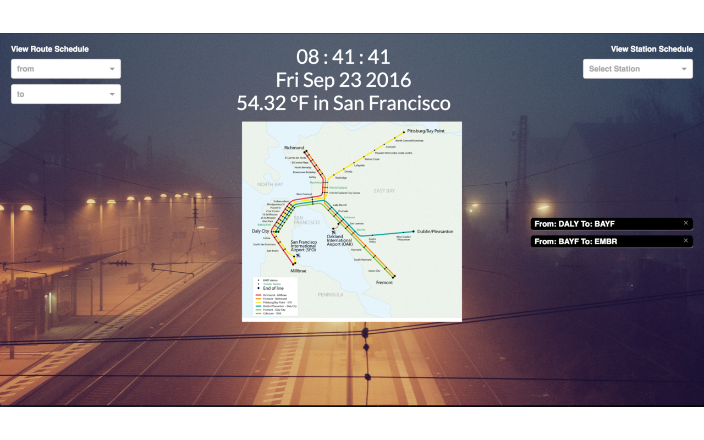

# Bartable-Tab

[Download Link](https://chrome.google.com/webstore/detail/bartable-tab/kfdikgedinibhfbbgbbpdnohjabcljei)




`Bartable-Tab` is a Chrome Extension which replaces the New Tab page in Chrome with a single-page application with the following functionalities:

* View real-time Bart schedules of a particular station
* View route schedules between 2 stations
* Save frequently used routes for convenience
* View clock and weather specific to physical location

## How to use:
There are two drop-downs on the top-left corner which can be used to view route schedules between 2 stations. Completing the `from` and `to` fields will display the route information as long as the selections are not the same. The displayed route information will have an option to save. Saved routes are displayed towards the middle-right of the page.


The drop-down on the top-right corner is used to view schedules of all trains leaving from the selected station.


Users may switch between °F and °C by clicking on the weather information.

## Implementation

### Technologies
This extension is written in `JavaScript`, along with `React` and `Redux` frameworks to achieve smooth and seamless user experience. Additionally, `chrome.storage` API is used to save data in Chrome.

### Weather

`Open Weather API` is utilized to fetch location specific weather information. The location of the computer is obtained using `geolocation` which is then used to make an API call to the Weather API to display location specific weather information.

To avoid extraneous fetching of weather information while opening multiple tabs, weather information is saved using `chrome.storage` with the current date. When the weather component mounts, it first fetches weather from the storage and checks how recent the information is by analyzing the date it was saved. It then decides if a new API call is to be made based on the date.

``` js
componentDidMount () {
  const that = this;
  this.getStorageWeather((option) => {
    return option ? that._updateLocation() : that._fetchGeoLocation() ;
  });

  //
  getStorageWeather(callback){
    const that = this;
    let option = false;
    chrome.storage.sync.get('weatherInfo', ({weatherInfo}) => {
      if (weatherInfo && weatherInfo.temperatureF && weatherInfo.temperatureC){
        option = true;

        if ( Math.round(Date.now() / minutes) - Math.round(weatherInfo.date / minutes) > 5 ){
          option = false;  //Information is old so obtain new location and make API call
        }
        that.setState({temperatureK: weatherInfo.temperatureK, temperatureF: weatherInfo.temperatureF, city: weatherInfo.city, temperatureC: weatherInfo.temperatureC, unitsF: weatherInfo.unitsF});
      }
      callback(option);
    });
  }
}
```

### Bart API

Once the extension is loaded, an API call is made to obtain a list of stations using `Bart API`. This list is saved using Redux and is used to populate the stations in the drop-down menu. Depending on the type of selection, a call is made to either obtain information of all trains for a specific station or to obtain information of trains between 2 stations. The response is saved using a Redux cycle and is used to render the schedule information.

Additionally, train schedules between 2 stations have the ability to be saved. If a user selects the schedule to be saved, the action first saves the selected stations in `chrome.storage` (for persisting data). The success callback for saving the data triggers a dispatch to update the `Redux Store`. This change in the `store` triggers rendering of a React component which lists the saved schedules.

```js
saveRoute(){
  const that = this;
  chrome.storage.local.get('scheduleInfo', data => {
    let key;
    if (!Object.keys(data).length){
      data = {};
      key = 0;
    } else {
      key = Object.keys(data['scheduleInfo']).length.toString();
      while (Object.keys(data['scheduleInfo']).includes(key)){
        key = (parseInt(key) + 1).toString();
      }
    }
    let saveData = {};
    saveData[key] = {orig: this.state.fromSelectedStation.value, dest: this.state.toSelectedStation.value};
    saveData = merge({}, data, {'scheduleInfo': saveData});
    chrome.storage.local.set(saveData, function() {
      that.scheduleContent = null;
      that.clearValues();
      that.props.requestScheduleStorage();
    });
  });
}
```


### Future Updates
* Display Bart advisories
* Add functionality to change wallpaper
