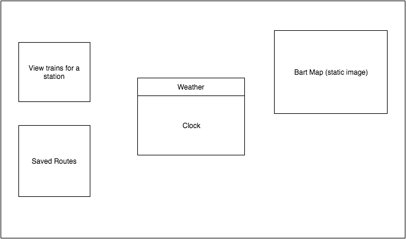

# Bartable Tab

## Background

Using the Bart, the bay area's train service, can be tricky if it's not planned correctly. This Chrome Extension will replace the New Tab page with a page in which a user can view train schedules for each station. Additionally, users can save a list of routes for convenience. The extension will also display a clock and utilize a user's current location to display weather information.

## Functionality & MVP

With this extension, users will be able to:

- [ ] View train schedules for a station
- [ ] Save a list of routes
- [ ] View a clock
- [ ] View weather information based on current location

## Wireframes

## Technologies

This extension will be implemented using the standard Chrome extension technology: Javascript, HTML, and CSS. Furthermore, React and Redux will also be utilized to dynamically generate content. In addition to the `manifest.json` and `package.json` files, there will also be an `index.html` file to display the content. `Webpack` will be utilized to bundle all my scripts to load it into `index.html`.

## Implementation Timeline

**Day 1**: Get started on the infrastructure of the extension, following <a href="https://developer.chrome.com/extensions/getstarted">this guide</a> from Chrome. Setup `Webpack` and load the output bundle file into `index.html`. By the end of the day, I will have:

- A completed `package.json`
- A completed `manifest.json`
- The ability to render the `index.html` file while opening a new tab in Chrome

**Day 2**: Work on setting up React and render React Component on `index.html`. Set up Bart API and create a Redux Cycle to fetch and store Bart data. By the end of the day, I will have:

- The ability to render React Components while opening a new tab in Chrome
- Bart data stored using Redux

**Day 3**: Work on saving Bart routes in Chrome `localstorage`. Use geolocation to obtain weather data.  By the end of the day, I will have:

- The ability to render a clock and weather information
- Functionality to save routes in Chrome `localstorage`

**Day 4**: Style the page.  By the end of the day, I will have a:

- Fully functional and styled page including a clock, weather info, and Bart schedules with the ability to save routes.

## Bonus
- If time permits, implement an interactive Bart map which highlights the route a user chooses.
